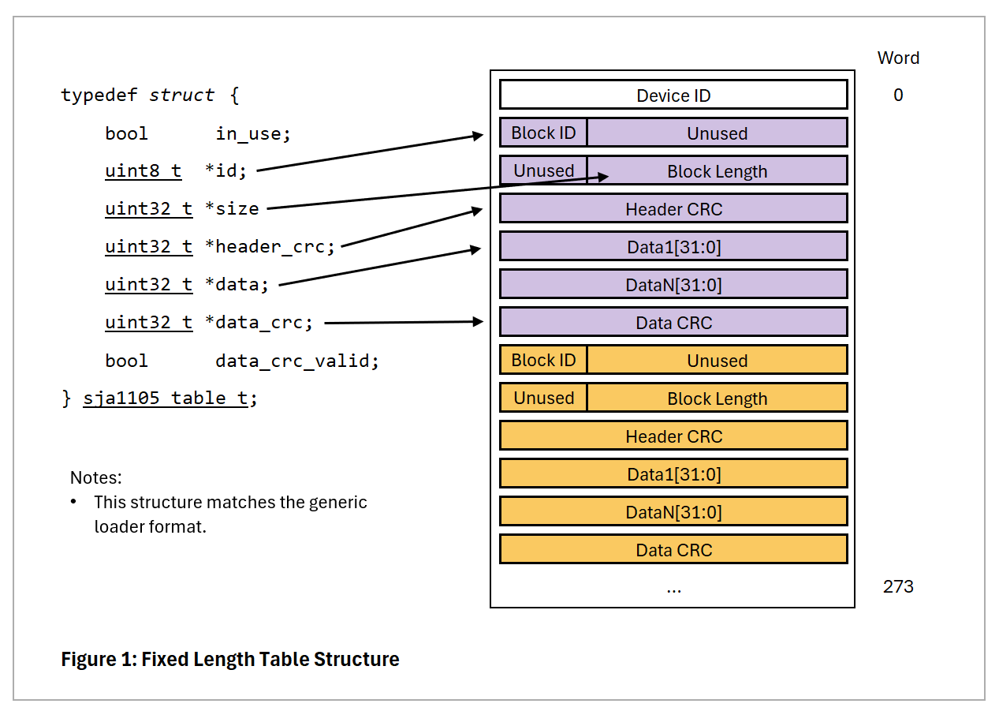
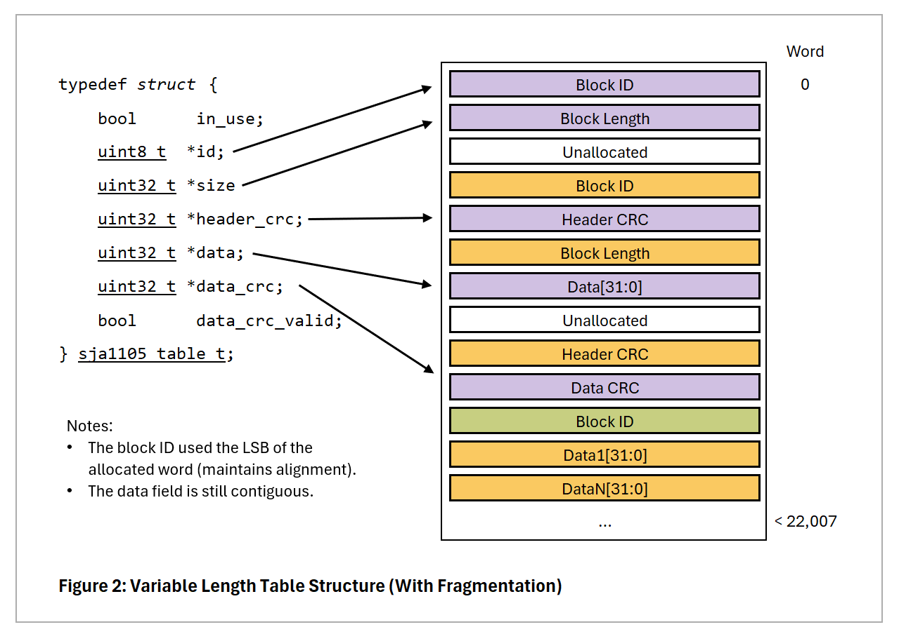

# SJA1105 Driver for STM32

This driver is intended for use on microcontroller platforms to control the SJA1105 automotive ethernet switch. This driver stores copies of the static configuration tables that mirror the state of the switch. When a change is required to a table that supports dynamic reconfiguration then this is done via the SPI interface. If a table doesn't support dynamic reconfiguration then the whole static configuration must be loaded again. 

## Memory Usage and Generic Loader Format

To store the configuration tables, two methods are used simultaneously, one for the fixed length tables and one for the variable length tables:

- *Fixed Length Tables:* These tables (such as the MAC Configuration table) have a fixed length and are stored in a buffer provided by the user. The maximum size of all the fixed length tables is 213x 32-bit words. Combined with their headers, CRC info, sizes and the device ID needed for the generic loader format this gives a total size of 274x 32-bit words. When the driver is initialised a buffer of this length must be passed to the device. This allows the driver to directly store the fixed length tables in the generic loader format for easy re-initialisation e.g. via DMA.

- *Variable Length Tables:* These tables (such as the VLAN Lookup table) contain a variable number of entries, and it doesn't make sense to store them in an array (since everything after the table would need to be moved to add a new entry). Instead these tables are stored in dynamically allocated memory, which is allocated and freed through the relevant callback functions. There can be up to 22,007x 32-bit words of dynamic entries (including headers and CRCs) so if a byte pool used it is recommended to size it accordingly to the maximum expected use (E.g. not all 4096 VLAN entries are likely to be used).

This approach means static reconfiguration can be completed in well under 1ms (at Fspi = 25MHz) if mostly fixed length tables are used.

Note that the last block of the generic loader format (which includes the gloabal CRC) is always sent individually.

## Thread Safety

All the functions in sja1105.h are thread safe, with the exception of SJA1105_PortConfigure() which should only be called from a single thread at startup and before SJA1105_Init().
